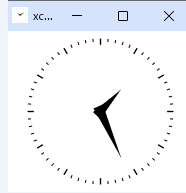

xclock
======

[Japanese](README.md)

A HTML5 implementation inspired by the classic X11 xclock.

This small project started because I simply wanted xclock on a locked-down Windows PC.

It is not intended to be a pixel-perfect clone.
Instead, it is a reimplementation that respects the original design while making it practical to use on modern Windows systems.

Respect xclock!!

Screenshot
-----------

## Web version

Default (without second hand):

https://mattdaimon.github.io/xclock/

With second hand:

https://mattdaimon.github.io/xclock/?seconds=1

Development
-----------

The author designed and reviewed this small program,
using ChatGPT for implementation and documentation.

Contents
--------

- index.html   Main program
- xclock.ico    Icon
- xclock.bat    Chrome app-mode launcher
- README.md     Japanese README
- README-EN.md  This document
- LICENSE.txt   MIT License
- docs/SPEC.md   Japanese specification
- docs/SPEC-EN.md English specification

Features
--------

- Single HTML file
- HTML5 Canvas and JavaScript only
- No external libraries
- Analog clock without a second hand by default
- Optional xclock-style second hand with `?seconds=1`
- One-second step movement when the second hand is enabled
- With seconds enabled, the minute hand advances each second and the hour hand advances once per minute
- The next update is aligned to the next second or minute boundary
- Corrects the display after Chrome resumes from suspension
- Readjusts the Canvas size after an Android browser resumes from device sleep
- Supports Windows paths containing Japanese and other non-ASCII characters
- Automatically fits a square canvas to the window
- Designed for Chrome app mode
- Uses a dedicated Chrome user-data directory so that the 200 x 200
  xclock window does not affect the normal Chrome window size

Installation
------------

1. Copy the entire xclock folder to any location.

   Example:

     C:\Users\username\AppData\Local\Programs\xclock\

2. Keep the following files in the same folder:

     - xclock.bat
     - index.html
     - xclock.ico

3. Double-click xclock.bat and confirm that the clock opens.

The batch file uses its own location to find index.html, so the folder can
be moved as long as xclock.bat and index.html remain together.

Recommended shortcut setup
--------------------------

1. Right-click xclock.bat.
2. Select "Show more options" if necessary.
3. Select "Send to" -> "Desktop (create shortcut)".
4. Open the shortcut properties.
5. On the "Shortcut" tab, set "Run" to "Minimized".
6. Select "Change Icon" and choose xclock.ico in the xclock folder.
7. Rename the shortcut to "xclock".

Setting "Run" to "Minimized" prevents the Command Prompt window used by the
batch file from being conspicuous when xclock starts.

Chrome profile separation
-------------------------

xclock.bat starts Chrome with this dedicated profile folder:

  %LOCALAPPDATA%\xclock-chrome-profile

This is separate from the normal Chrome profile. Therefore, xclock's
200 x 200 window size and position should not affect ordinary Chrome windows.

The dedicated folder is created automatically on first launch.

It may be deleted to reset only the xclock Chrome profile. Close xclock before
deleting it.

Startup
-------

To start xclock automatically when signing in to Windows:

1. Press Win + R.
2. Enter:

     shell:startup

3. Place the xclock shortcut in the Startup folder.

Place the shortcut there, not a separate copy of xclock.bat. This preserves
the shortcut's "Minimized" setting and selected icon.

Always on top
-------------

Windows does not provide a built-in always-on-top option for this HTML file.

Microsoft PowerToys can be used:

  Win + Ctrl + T

Press the shortcut while the xclock window is active.

Configuration
-------------

The settings most likely to be changed are grouped at the top of xclock.bat:

  set "WINDOW_WIDTH=200"
  set "WINDOW_HEIGHT=200"
  set "SHOW_SECONDS=0"

Change `WINDOW_WIDTH` and `WINDOW_HEIGHT` to use another initial size.
The clock itself redraws to fit the current window.

To display the second hand, change the setting to:

  set "SHOW_SECONDS=1"

For the Web version, append `?seconds=1` to the URL:

  https://mattdaimon.github.io/xclock/?seconds=1

The only enabled value is `1`. No parameter, `0`, `true`, and other values keep the second hand hidden.

Chrome location
---------------

The batch file expects Chrome at:

  C:\Program Files\Google\Chrome\Application\chrome.exe

When Chrome is installed elsewhere, edit the CHROME line in xclock.bat.

Troubleshooting
---------------

1. "The file cannot be accessed"

   Confirm that xclock.bat and index.html are in the same folder.
   Do not rename index.html unless xclock.bat is changed as well.

2. xclock opens in a normal Chrome tab

   Close all xclock windows and launch it again from xclock.bat.
   Confirm that the dedicated profile folder is writable.

3. Normal Chrome opens at 200 x 200

   Confirm that xclock was launched using xclock.bat. The supplied batch file
   uses a dedicated Chrome user-data directory.

   Restore the normal Chrome window to the desired size, then close that
   window last so Chrome saves the new placement.

4. A black Command Prompt window briefly appears

   Create a shortcut to xclock.bat and set the shortcut's "Run" option to
   "Minimized" as described above.

5. Japanese or other non-ASCII user names

   The supplied batch file uses PowerShell to convert the local Windows path
   into a valid file URL.

   User names and folder names containing Japanese or other non-ASCII characters
   are supported. No user name needs to be written directly in the command.

   xclock.bat may not work when PowerShell is disabled by an organizational
   security policy.

License
-------

MIT License. See LICENSE.txt.
